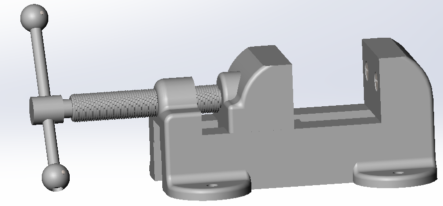

# Machine Vise Assembly

## Overview

This repository contains the design files for a Machine Vise Assembly, a precision tool for securing workpieces during machining. The assembly includes CAD models and technical drawings for manufacturing and assembly.

## Components

- **Base**: Stationary foundation for mounting.
- **Sliding Jaw**: Movable jaw for clamping workpieces.
- **Jaw Plate**: Replaceable plates for gripping.
- **Vise Screw**: Threaded screw (e.g., 0.625-8 ACME) to drive the sliding jaw.
- **Collar**: Secures the vise screw and supports axial loads.
- **Special Key**: Custom tool for alignment or securing components.
- **Handle Rod**: Rod for manual operation of the vise screw.
- **Handle Ball**: Ergonomic grips for the handle rod.
- **Slide Key**: Guides linear movement of the sliding jaw.
- **Set Screw**: Fasteners for securing components.

## Demo Video

Click the thumbnail below to view the assembly process:

